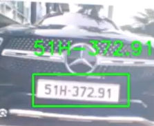

# Automatically identify numbers
	Step 1: Download the zip file
	Step 2: Turn on and run the main2.py file (I use pycharm to run)
	Step 3: You can use it normally
 
"license_plate_recognition_model (1).h5" this is a model trained to recognize license plates in a photo

Note: The project is created during the learning process.

